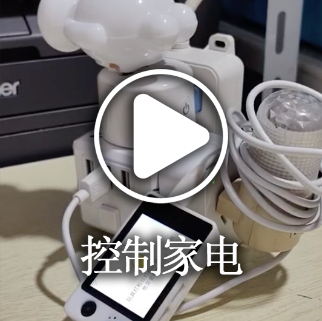

[](https://github.com/xinnan-tech/xiaozhi-esp32-server)
<p align="center">
  <a href="https://github.com/xinnan-tech/xiaozhi-esp32-server/graphs/contributors">
    
  </a>
  <a href="https://github.com/xinnan-tech/xiaozhi-esp32-server/issues">
    
  </a>
  <a href="https://github.com/xinnan-tech/xiaozhi-esp32-server/pulls">
    
  </a>
</p>

# XiaoZhi ESP-32 Backend Service (xiaozhi-esp32-server)

([中文](README.md) | English)

This project provides the backend service for the open source smart hardware project [xiaozhi-esp32](https://github.com/78/xiaozhi-esp32). It is implemented in `Python` based on the [XiaoZhi Communication Protocol](https://ccnphfhqs21z.feishu.cn/wiki/M0XiwldO9iJwHikpXD5cEx71nKh).

---

## Target Audience 👥

This project is designed to be used in conjunction with ESP32 hardware devices. If you have already purchased an ESP32 device, successfully connected to the backend service deployed by XieGe, and now wish to set up your own `xiaozhi-esp32` backend service, then this project is perfect for you.

Want to see it in action? Check out the videos 🎥

<table>
  <tr>
    <td>
      <a href="https://www.bilibili.com/video/BV1FMFyejExX" target="_blank">
        <picture>
          
        </picture>
      </a>
    </td>
    <td>
      <a href="https://www.bilibili.com/video/BV1CDKWemEU6" target="_blank">
        <picture>
          
        </picture>
      </a>
    </td>
    <td>
      <a href="https://www.bilibili.com/video/BV12yA2egEaC" target="_blank">
        <picture>
          
        </picture>
      </a>
    </td>
    <td>
      <a href="https://www.bilibili.com/video/av114036381327149" target="_blank">
        <picture>
          
        </picture>
      </a>
    </td>
    <td>
      <a href="https://www.bilibili.com/video/BV1kgA2eYEQ9" target="_blank">
        <picture>
          
        </picture>
      </a>
    </td>
    <td>
    </td>
  </tr>
</table>

---

## System Requirements and Deployment Prerequisites 🖥️

- **Hardware**: A set of devices compatible with `xiaozhi-esp32` (for specific models, please refer to [this link](https://rcnv1t9vps13.feishu.cn/wiki/DdgIw4BUgivWDPkhMj1cGIYCnRf)).
- **Server**: A computer with at least a 4-core CPU and 8GB of memory.
- **Firmware Compilation**: Please update the backend service API endpoint in the `xiaozhi-esp32` project, then recompile the firmware and flash it to your device.

---

## Warning ⚠️

This project is relatively new and has not yet undergone network security evaluations. **Do not use it in a production environment.**

If you deploy this project on a public network for learning purposes, be sure to enable protection in the configuration file `config.yaml`:

```yaml
server:
  auth:
    # Enable protection
    enabled: true  
```

Once protection is enabled, you will need to validate the machine's token or MAC address based on your actual situation. Please refer to the configuration documentation for details.

---

## Feature List ✨

### Implemented ✅

- **Communication Protocol**  
  Based on the `xiaozhi-esp32` protocol, data exchange is implemented via WebSocket.
- **Dialogue Interaction**  
  Supports wake-up dialogues, manual conversations, and real-time interruptions. Automatically enters sleep mode after long periods of inactivity.
- **Multilingual Recognition**  
  Supports Mandarin, Cantonese, English, Japanese, and Korean (default using FunASR).
- **LLM Module**  
  Allows flexible switching of LLM modules. The default is ChatGLMLLM, with options to use AliLLM, DeepSeek, Ollama, and others.
- **TTS Module**  
  Supports multiple TTS interfaces including EdgeTTS (default) and Volcano Engine Doubao TTS to meet speech synthesis requirements.

### In Development 🚧

- Conversation Memory Feature
- Multiple Mood Modes
- Smart Control Panel Web UI


---

## Supported Platforms/Components 📋

### LLM

| Type |         Platform Name         |         Usage Method          |   Pricing Model   |                                 Remarks                                  |
|:----:|:-----------------------------:|:-----------------------------:|:-----------------:|:-------------------------------------------------------------------------:|
| LLM  |   AliLLM (阿里百炼)           | OpenAI API call               | Token consumption | [Click to apply for API key](https://bailian.console.aliyun.com/?apiKey=1#/api-key) |
| LLM  | DeepSeekLLM (深度求索)        | OpenAI API call               | Token consumption |          [Click to apply for API key](https://platform.deepseek.com/)         |
| LLM  | ChatGLMLLM (智谱)             | OpenAI API call               | Free              | Although free, you still need to [click to apply for an API key](https://bigmodel.cn/usercenter/proj-mgmt/apikeys) |
| LLM  | OllamaLLM                   | Ollama API call               | Free/Custom       | Requires pre-downloading the model (`ollama pull`); service URL: `http://localhost:11434` |
| LLM  | DifyLLM                     | Dify API call                 | Token consumption | For local deployment. Note that prompt configuration must be set in the Dify console. |
| LLM  | GeminiLLM                   | Gemini API call               | Free              | [Click to apply for API key](https://aistudio.google.com/apikey) |
| LLM  | CozeLLM                     | Coze API call                 | Token consumption | Requires providing bot_id, user_id, and personal token. |
| LLM  | Home Assistant              | Home Assistant voice assistant API call | Free       | Requires providing a Home Assistant token. |

In fact, any LLM that supports OpenAI API calls can be integrated.

---

### TTS

| Type |             Platform Name              | Usage Method |   Pricing Model   |                                       Remarks                                        |
|:----:|:--------------------------------------:|:------------:|:-----------------:|:--------------------------------------------------------------------------------------:|
| TTS  |               EdgeTTS                  | API call     | Free              | Default TTS based on Microsoft's speech synthesis technology.                        |
| TTS  | DoubaoTTS (火山引擎豆包 TTS)             | API call     | Token consumption | [Click to create an API key](https://console.volcengine.com/speech/service/8); it is recommended to use the paid version for higher concurrency. |
| TTS  | CosyVoiceSiliconflow                   | API call     | Token consumption | Requires application for the Siliconflow API key; output format is WAV.                |
| TTS  | CozeCnTTS                              | API call     | Token consumption | Requires providing a Coze API key; output format is WAV.                               |
| TTS  | FishSpeech                             | API call     | Free/Custom       | Starts a local TTS service; see the configuration file for startup instructions.       |
| TTS  | GPT_SOVITS_V2                          | API call     | Free/Custom       | Starts a local TTS service, suitable for personalized speech synthesis scenarios.      |

---

### VAD

| Type |    Platform Name    | Usage Method | Pricing Model | Remarks |
|:----:|:-------------------:|:------------:|:-------------:|:-------:|
| VAD  | SileroVAD           | Local        | Free          |         |

---

### ASR

| Type |    Platform Name    | Usage Method | Pricing Model | Remarks |
|:----:|:-------------------:|:------------:|:-------------:|:-------:|
| ASR  | FunASR              | Local        | Free          |         |
| ASR  | SherpaASR           | Local        | Free          |         |
| ASR  | DoubaoASR           | API call     | Paid          |         |

---

## Usage 🚀

### 1. [Deployment Documentation](./docs/Deployment.md)

This project supports three deployment methods. Choose the one that best fits your needs.

The documentation provided here is a **written tutorial**. If you prefer a **video tutorial**, you can refer to [this expert's hands-on guide](https://www.bilibili.com/video/BV1gePuejEvT).

Combining both the written and video tutorials can help you get started more quickly.

1. [Docker Quick Deployment](./docs/Deployment.md)  
   Suitable for general users who want a quick experience without extensive environment configuration. The only downside is that pulling the image can be a bit slow.

2. [Deployment Using Docker Environment](./docs/Deployment.md#%E6%96%B9%E5%BC%8F%E4%BA%8C%E5%80%9F%E5%8A%A9docker%E7%8E%AF%E5%A2%83%E8%BF%90%E8%A1%8C%E9%83%A8%E7%BD%B2)  
   Ideal for software engineers who already have Docker installed and wish to customize the code.

3. [Running from Local Source Code](./docs/Deployment.md#%E6%96%B9%E5%BC%8F%E4%B8%89%E6%9C%AC%E5%9C%B0%E6%BA%90%E7%A0%81%E8%BF%90%E8%A1%8C)  
   Suitable for users familiar with the `Conda` environment or those who wish to build the runtime environment from scratch.

For scenarios requiring higher response speeds, running from the local source code is recommended to reduce additional overhead.

### 2. [Firmware Compilation](./docs/firmware-build.md)

Click [here](./docs/firmware-build.md) for a detailed guide on firmware compilation.

After successful compilation and network connection, wake up XiaoZhi using the wake-up word and monitor the server console for output.

---

## Frequently Asked Questions ❓

### 1. TTS often fails and times out ⏰

**Suggestion:**  
If `EdgeTTS` frequently fails, please first check whether you are using a proxy (VPN). If so, try disabling the proxy and try again. If you are using Volcano Engine Doubao TTS and it often fails, it is recommended to use the paid version since the trial only supports 2 concurrent requests.

### 2. I want to control lights, air conditioners, remote power on/off, etc. with XiaoZhi 💡

**Suggestion:**  
Set the `LLM` to `HomeAssistant` in the configuration file and use the `HomeAssistant` API to perform the relevant controls.

### 3. I speak slowly, and XiaoZhi always interrupts during pauses 🗣️

**Suggestion:**  
Locate the following section in the configuration file and increase the value of `min_silence_duration_ms` (for example, change it to `1000`):

```yaml
VAD:
  SileroVAD:
    threshold: 0.5
    model_dir: models/snakers4_silero-vad
    min_silence_duration_ms: 700  # If your pauses are longer, increase this value
```

### 4. Why does XiaoZhi recognize a lot of Korean, Japanese, and English in what I say? 🇰🇷

**Suggestion:**  
Check whether the `model.pt` file exists in the `models/SenseVoiceSmall` directory. If it does not, please download it. See [Download ASR Model Files](docs/Deployment.md#模型文件) for details.

### 5. Why does the error “TTS task error: file does not exist” occur? 📁

**Suggestion:**  
Verify that you have correctly installed the `libopus` and `ffmpeg` libraries using `conda`. If not, install them using:

```
conda install conda-forge::libopus
conda install conda-forge::ffmpeg
```

### 6. How can I improve XiaoZhi's dialogue response speed? ⚡

The default configuration of this project is designed to be cost-effective. It is recommended that beginners first use the default free models to ensure that the system runs smoothly, then optimize for faster response times.  
To improve response speed, you can try replacing individual components. Below are the response time test results for each component (for reference only, not a guarantee):

**LLM Performance Ranking:**

| Module Name  | Average First Token Time | Average Total Response Time |
|--------------|--------------------------|-----------------------------|
| AliLLM       | 0.547s                   | 1.485s                      |
| ChatGLMLLM   | 0.677s                   | 3.057s                      |
| OllamaLLM    | 0.003s                   | 0.003s                      |

**TTS Performance Ranking:**

| Module Name                | Average Synthesis Time |
|----------------------------|------------------------|
| EdgeTTS                    | 1.019s                 |
| DoubaoTTS                  | 0.503s                 |
| CosyVoiceSiliconflow       | 3.732s                 |

**Recommended Configuration Combination (Overall Response Speed):**

| Combination Scheme                | Overall Score | LLM First Token | TTS Synthesis |
|-----------------------------------|---------------|-----------------|---------------|
| AliLLM + DoubaoTTS                | 0.539         | 0.547s          | 0.503s        |
| AliLLM + EdgeTTS                  | 0.642         | 0.547s          | 1.019s        |
| ChatGLMLLM + DoubaoTTS            | 0.642         | 0.677s          | 0.503s        |
| ChatGLMLLM + EdgeTTS              | 0.745         | 0.677s          | 1.019s        |
| AliLLM + CosyVoiceSiliconflow     | 1.184         | 0.547s          | 3.732s        |

**Conclusion 🔍**

_As of February 19, 2025, if my computer were located in Haizhu District, Guangzhou, Guangdong Province, and connected via China Unicom, I would prioritize using:_

- **LLM:** `AliLLM`
- **TTS:** `DoubaoTTS`

### 7. For more questions, feel free to contact us for feedback 💬

Our contact information is in [Baidu Netdisk](https://pan.baidu.com/s/1x6USjvP1nTRsZ45XlJu65Q)，The extraction code is`223y`。

---

## Acknowledgements 🙏

- This project was inspired by the [Bailing Voice Dialogue Robot](https://github.com/wwbin2017/bailing) and implemented based on it.
- Many thanks to [Tenclass](https://www.tenclass.com/) for providing detailed documentation support for the XiaoZhi communication protocol.

<a href="https://star-history.com/#xinnan-tech/xiaozhi-esp32-server&Date">
 <picture>
   <source media="(prefers-color-scheme: dark)" srcset="https://api.star-history.com/svg?repos=xinnan-tech/xiaozhi-esp32-server&type=Date&theme=dark" />
   <source media="(prefers-color-scheme: light)" srcset="https://api.star-history.com/svg?repos=xinnan-tech/xiaozhi-esp32-server&type=Date" />
   
 </picture>
</a>